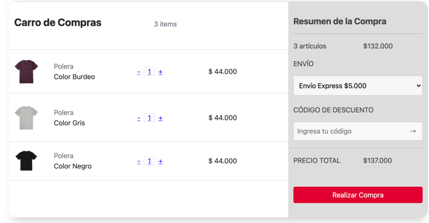

# Simple.co

EJERCICIO:
La marca de ropa "Simple.co" ha comenzado a renovar su sitio web. Durante el tercer trimestre del año pasado, la compañía perdió el 27% de sus ventas debido a las devoluciones emitidas por compras realizadas erróneamente.
Para evitar este problema, el equipo de desarrollo de Simple.co debe incorporar una serie de cambios en el sitio web; y para ello, el gerente de desarrollo te ha solicitado utilizar jQuery, y tu conocimiento sobre los manejadores de eventos.

